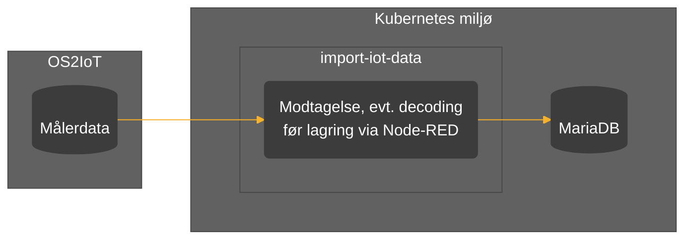

# import-iot-data `README.md`
[**Formål**](#formål) | [**Beskrivelse**](#beskrivelse) | [**Afhængigheder**](#afh%C3%A6ngigheder)

## Formål

Formålet med applikationen er at modtage og lagre store mængder IoT data fra målere opsat i kommunale bygninger og institutioner via OS2IoT.

## Beskrivelse

Målerdata modtages fra OS2IoT via en POST request på endpoint `/os2iot`. 
Applikationen modtager dataobjekter som følger denne JSON objekt struktur:

    [
	    {
		    "deviceEui": string,
		    "observedAt" unix timestamp string,
		    "values": [
			    {
				    "type": string,
				    "value": number
			    }
		    ],
		    "rssi": number,
		    "batteryLevel": number
	    }
    ]

***OBS**: Applikationen har indbygget dekodning af Adeunis enheder, da OS2IoT ikke understøtter dette. Sæt her nøglen `decoder` i samme objekt med værdien `adeunis`, og i stedet for `values` populeres nøglen `data` med rå data fra enheden i hexadecimal format.* 

Modtagne data gemmes i SQL database (MariaDB) hvis der allerede findes metadata for den gældende måler i databasen. Metadata oprettes for målere når disse registreres med [admin-iot-devices](https://github.com/Randers-Kommune-Digitalisering/admin-iot-devices).

Data for individuelle målere gennes i separate tabeller med følgende struktur:
| observedAt | type | value |
|--|--|--|
| timestamp | varchar | float |
`UNIQUE(observedAt, type)`

 - *Unique-statementet gør at det ikke er muligt at have 2 datapunkter
   med samme type og samme timestamp.*

Tabellen oprettes med navnet `iot_data_{{deviceEui}}`, og en reference gemmes i metadata for måleren når tabellen oprettes.

## Afhængigheder

:gear: | [Node.js 18](https://docs.npmjs.com/downloading-and-installing-node-js-and-npm),  [Node-RED 3.0.2](https://nodered.org/docs/getting-started/windows), NPM-moduler: `@adeunis/node-red-contrib-adeunis-codecs`, `node-red-mysql-r2`

:cloud: | Adgang for indgående trafik til endpoint  `/os2iot`

:heavy_dollar_sign: | Miljøvariabler for database: 	`DB_HOST`, `DB_PORT`, `DB_DATABASE`, `DB_USER`, `DB_PASS`
